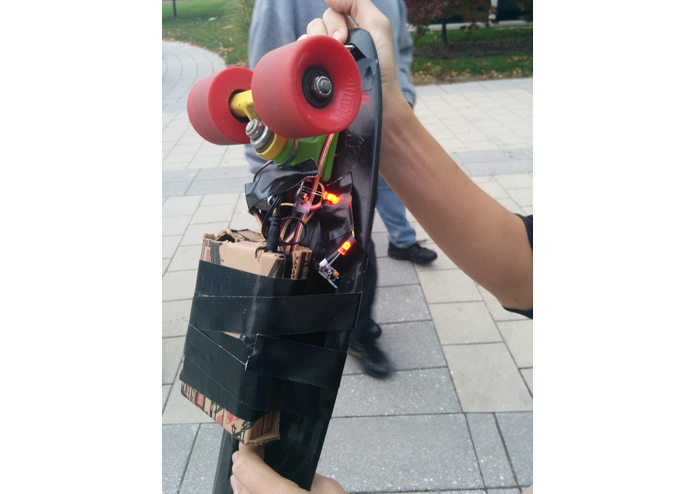
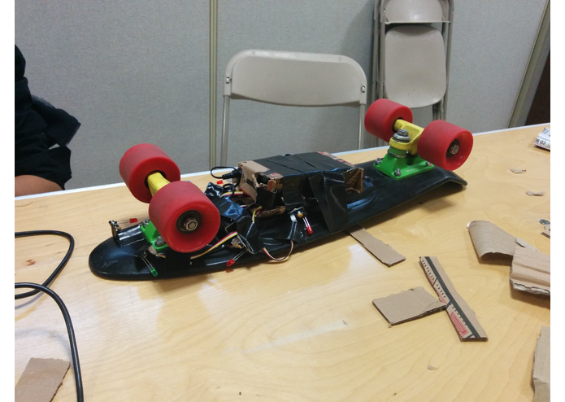
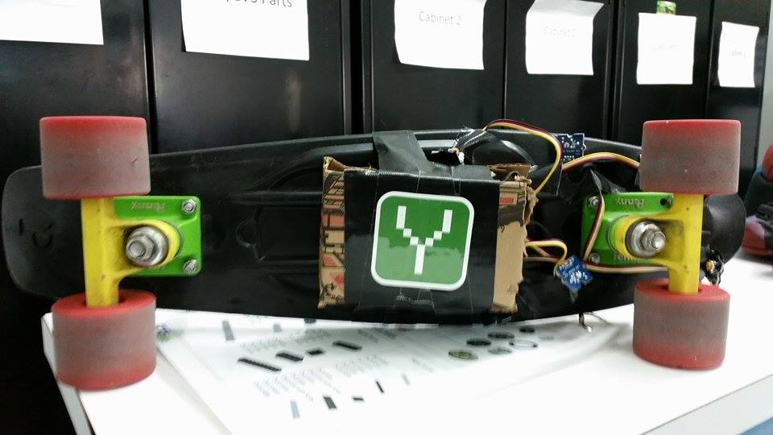
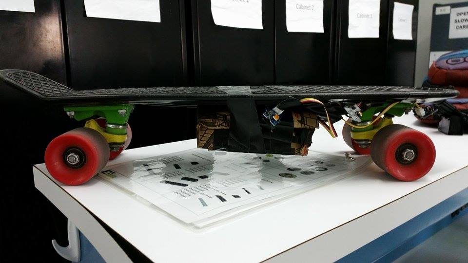

 
<small><i>Just cruising</i></small>
  

I've always wanted to do a hardware hack at a hackathon. So what better idea than to try one out at [YHack](http://www.yhack.org/), where a friend, Patrick, who knew hardware well was teaming up with me. We didn't have any ideas for a hardware hack, but we knew we wanted to work on a crazy and challenging idea. When we got there, we realized that our options were severaly limited for a hardware hack. We didn't have any robots or drones nor the necessary parts to build a robot or drone. Adding onto that, we weren't able to borrow any hardware devices because the organizers ran out of them. All we had were the things I brought: a [LEAP motion](https://www.leapmotion.com/), [three Estiomote beacons](http://estimote.com/), [Arduinos](http://arduino.cc/), Intel microcontrollers, and various electrical components.

But there a small pinhole of light in the darkness. Intel Maker Kits were being given out in the Intel Developer Zone. I had received the kit before with an [Intel Edison](http://www.intel.com/content/www/us/en/do-it-yourself/edison.html) but I didn't expect much from it. The documentation was poor and even sometimes incorrect, few people have used it beforehand, and the software was still in development! The Intel Edison has a bluetooth module built into it but there is no software there to run it yet. However, the Intel microcontrollers shouldn't be judged too harshly. They are very capable of becoming very powerful microcontrollers, but it will take time.

Anyways, we still had no idea what to do with the hardware we had. But there was another small pinhole that the light shone through. I had brought my penny board to Yhack because I bring it with me everywhere. That was it. We were going to hack on a skateboard. After some brainstorming (electric longboard, temperature sensors with LEDs to tell the weather), we decided to prioritize on one idea.

###GPS navigation on a penny board

We decided on the materials as we went along. I'm going to list what we used here:

>		an Intel Edison
>		a Grove starter kit plus – Intel IoT Edition for Intel Galileo Gen 2
>		an Android device with data and GPS capabilities as well as a way to program it
>		some form of lighting in preferably red because I like red

The idea was to get out on the street, take out your phone, and input a location onto our self-programmed app. Then, the phone will transmit information to the board so as you're riding it towards an intersection, the board will tell you if you need to turn in order to get to your destination. The point of the lighting was to tell you when to turn. If the right side of the board lit up, then it would be telling you to turn right. If the left side lit up, turn left. If both sides were off, then go straight ahead.  

 
<small><i>Turn left</i></small>
 

We started with me working on the Android app and Patrick working on the microcontroller. It was a disaster. Patrick had trouble being able to just program his microcontroller due to its faulty software, numerous errors, and poor documentation. I was not very productive with the Android app as well. This went on for around for what I believe was over 25 or so hours until we switched places. As Patrick's part, the Android app, started to show progress, I had nothing to show. He would exclaim "awww yeah" and in response I would saw "oh nooo" haha. Thankfully, I was able to ask the guys down at the Intel Developer Zone for help. Basically, in the first 29 hours were completely we had no idea what we were doing. It was only in the following 7 hours did everything go as smooth as butter.  

 
<small><i>The setup</i></small>
 

In the last few hours, I finally figured out how to communicate between the board and the phone. Here's how it works. Since the bluetooth doesn't work, I had the Edison host its own WiFi network for devices to connect to. Then, I created a server that would do an action depending on what web page a GET request was sent to. The website was http://192.168.42.1:1337/, so if a device sent a GET request to http://192.168.42.1:1337/0, the server would return a 0. If the request was sent to http://192.168.42.1:1337/1, a 1 would be returned. Then I mapped numbers to commands. 

0 would mean that both side lights would be off. 
 
1 would mean that the right side would be on. 
 
2 would mean that the left side would be on.

Then, I wired the microcontroller to as many LEDs as possible&mdash;we ended up with 3 red LEDs on each side. I then <del>gracefully</del> attached the hardware to the bottom of the board with tape. In order to protect the Edison from debris & water that gets kicked up by the front wheels or collisions, we cut out a totally secure, custom-built cardboard box from a pizza box. It turns out that it was very easy to short the device because of all the naked electrical contact points, so we used tape in order to minimize that risk. After some testing, the hack was complete. We ran out of the building at freezing cold weather right before the submission deadline. I flew around on the street on the penny board to test it. Everything worked beautifully. As I chose a random destination close by and as I approached intersections, the sides of the board lit up and told me to turn when I had to.

Also, we [won](http://challengepost.com/software/penny-pimping)! The prize is Nexus tablets, but I don't know whether they are Nexus 9 or Nexus 7. Time will tell.

YHack was a massive amount of fun. It was the only hackathon I went to (and I know of) that had a rap battle during the hackathon. I also was able to borrow a second penny board, so Patrick and I went out to teach him how to skateboard at around 3 AM. It's too bad that the hackathon was in a far, isolated part of campus and the weather was cold and rainy that weekend.

Speaking of him, we're already planning ahead for crazier hardware hacks we're going to create in the future, and this time we'll actually prepare for them. I'd like to revisit the idea of a smart longboard in the future. Maybe it'll be able to lock itself, thus allowing only the owner and those he allow to use it. What if we add turn signal blinkers, and an electric generator to charge your phone while skating? Maybe it'll have GPS location capabilities in case an owner lost the longboard. Many people I met automatically assumed that it was an electric skateboard, so that's definitely a must.  

 
		 

<small><i>The bottom and side views</i></small>
  

Until next time..

[The Android source code](https://github.com/PennyPimping/android)

[The Edison source code](https://github.com/PennyPimping/Edison)

[Our Challengepost page](http://challengepost.com/software/penny-pimping)
