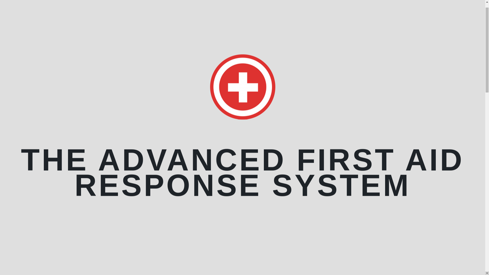

 
<small><i>The landing page. Note the design recycling.</i></small>

I remember on a warm June afternoon on the streets in New York City my friends and I were heading to a park. As I was about to cross the street, I heard my friends yell for my name. When I turned, I saw a man who stopped breathing with some food lodged down the wrong pipe in his throat. The people there who were currently trying to help him clearly did not know first aid and were about to stick their fingers down his mouth. Thankfully, a man and I ran up to him and were able to save him with proper first aid training.

###The thing is, what happens when those who know first aid are missing in an emergencies like this?

In New York City and other densely populated places, it can take over 15 minutes for an ambulance to arrive in time to help one in need. In cases such as when people have cardiac arrest, it's common logic that every minute a victim's heart's not beating, the greater the chances of death. We need a way for people in medical emergencies to get help earlier. That's where <b>AFAR</b> comes in.

###How does it work?

1. When a medical emergency happens with no medical professional or First Aid trained people nearby, the AFAR system will be notified of the emergency and its location via text messaging or a mobile app.
2. The AFAR system will then send the emergency details to all program volunteers that have previously signed up and proved that they are qualified to perform first aid.
3. At the same time, AFAR will also automatically call 911 or whatever emergency number corresponds to the country of the distress call, thus sending an ambulance or whatever service you need.
4. Response to medical emergencies will increase and save lives.s